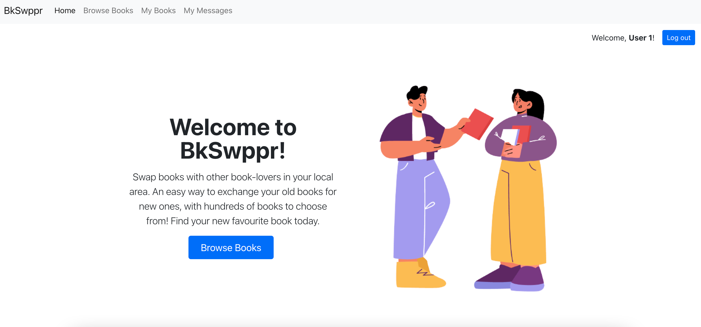
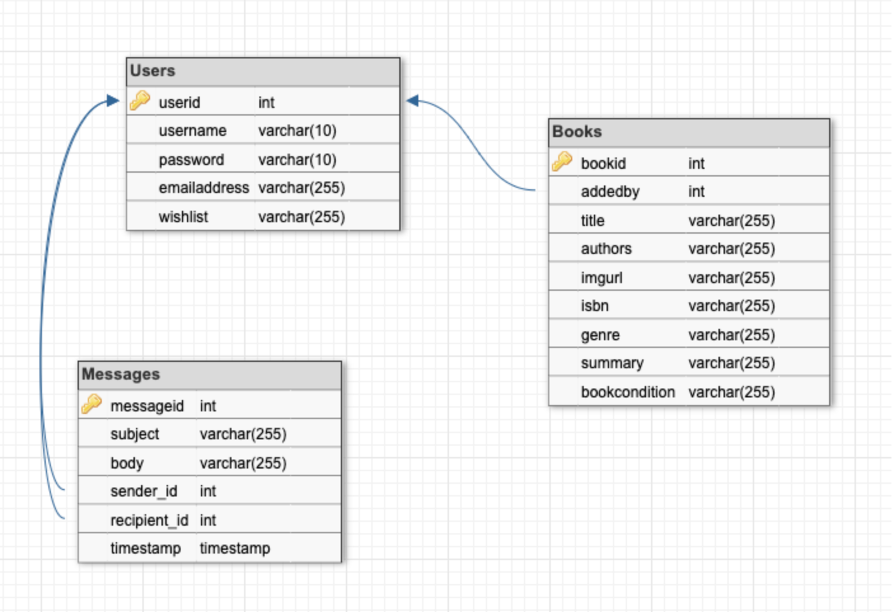

# Book Swapper

## Table of Contents

1. [Overview and goals](#overview-and-goals)
2. [Installation instructions](#installation-instructions)
3. [Technologies used](#technologies-used)
4. [Database schema](#database-schema)
5. [Future features](#future-features)
6. [Acknowledgements](#acknowledgements)

## Overview and goals

I developed this project in response to a problem that I observed in my bookclub -- if you love reading, buying books can get pretty expensive! Shopping in second-hand stores is one solution, but here in Barcelona, it can be difficult to find second-hand books in English. So, I decided to develop an app that book-lovers could use to exchange pre-loved books.

## Installation instructions

### Setting up your local repository

1. Fork the repo into your GitHub. Copy the address and run git clone to save a local version on your computer.
2. Install dependencies by running ``yarn`` or ``npm install`` in both the client and server folders.
3. Create a .env folder with the following content (change the password if you use a different password for MySQL):
``DB_HOST=localhost
DB_USER=root
DB_PASS=root
DB_NAME=bookswap
``
4. Run ``yarn migrate`` or ``npm migrate`` to populate the database with dummy information.
5. Run ``yarn start`` or ``npm start`` in the server and client folders. 

### Setting up your Google Books API Key

1. To use the external API part of the app, you need to get a Google API key using [these instructions](https://developers.google.com/books/docs/v1/using#APIKey).
2. Create a .env file in the client folder containing the following: REACT_APP_API_KEY=[ Your API key goes here ].

## Technologies used

* Front end built with ReactJS and React Router and styled with Bootstrap and custom CSS.
* Back end built with ExpressJS and NodeJS.
* Database designed with DBDesigner.net and built with MySQL. 

## Database schema

<!-- ROADMAP -->

## Future features

Features that I'd like to add to the app in the future include:

-[] User authentication and authorisation
-[] Search functionality on the "Browse Books" view
-[] Ability for users to save books that they are interested in
-[] Ability for users to upload images from their computer, rather than providing a URL

<!-- ACKNOWLEDGMENTS -->
## Acknowledgements

* Home page graphic created by upklyak and sourced from [Freepik.com](https://www.freepik.com/vectors/people-book)
* 404 page graphic from [Craftwork](http://www.craftwork.design)

_This is a student project that was created at [CodeOp](http://codeop.tech), a full stack development bootcamp in Barcelona._

[Back to Top](#book-swapper)
